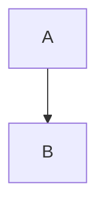
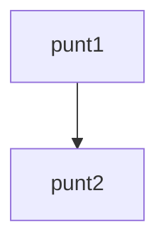
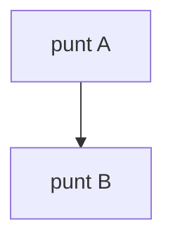
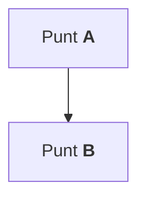

Met mermaid kunnen flowcharts gemaakt worden door middel van "flowchart" of "graph" op de eerste lijn te zetten. Binnen deze diagrammen kunnen verschillende [[Mermaid#Punten|punten]] verbonden worden door middel van pijlen.

~~~

~~~

Resultaat:

# Punten

## ID als naam

Er zijn meerdere manieren om punten binnen een flowchart aan te geven, de meest simpele manier is door direct de tekst van het punt neer te zetten:

~~~

~~~

Resultaat:

Deze manier is minder flexibel omdat er geen spaties binnen de namen gezet kunnen worden. Ook ontstaan er problemen wanneer er bijvoorbeeld een quote (`"`) aan het begin van de naam komt te staan. 

## Punt met tekst

Voor meer flexibiliteit is het mogelijk om blokhaken (`[]`) met de tekst van het punt na het ID van de node te zetten:

~~~

~~~

Resultaat:

### Effecten in de tekst

Het is ook mogelijk om [[Markdown/Effecten|effecten]] van markdown toe te passen op de tekst. Dit is mogelijk door een quote en backtick om de tekst binnen de blokhaken (``["` `"]``) te zetten zoals in dit voorbeeld waarin de letters van de punten [[Markdown/Effecten#Dikgedrukte tekst|dikgedrukt]] gemaakt worden:

~~~

~~~

Resultaat:

### Escapen van karakters

==eeeeeeee #18969376 #8272 GEEN \\==

## Definitie aan het einde
%%==als alle diagrammen dit gebruiken verplaats naar [[Mermaid]] ==%%