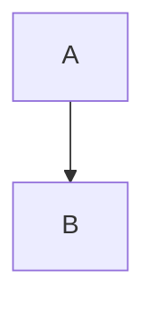

# Codeblok

Om een diagram met mermaid te maken is er een [[Code blocks|code block]] nodig. Door de taal op `mermaid` te zetten kan hier een diagram in gemaakt worden:

~~~

~~~

Resultaat:

> [!bug]- "end" binnen een diagram
> Het woord `end` kan problemen binnen diagrammen veroorzaken. Dit kan voorkomen worden door quotes (`"`) om het woord heen te zetten: "end"
# Comments

binnen de diagrammen kunnen ook comments toegevoegd worden. Dit kan gedaan worden door twee procenttekens (`%%`) gevolgd door de comment neer te zetten. deze zijn alleen zichtbaar tijdens het bewerken van een diagram en niet in het diagram zelf:

~~~

~~~

Resultaat:

Deze comments mogen alleen op lege lijnen tussen de code, het is **niet** mogelijk om een comment toe te voegen op dezelfde lijn zoals: `A --> B %%A naar B%%`

%%==`ctrl shift i` op quartz: laat dit de source met comments zien???==%%
> [!error]- Accolades (`{}`) binnen comments
> Als er direct na het maken van een comment een accolade geopend wordt (`%%{`) zal dit gezien worden als [[mermaid/Directives|directive]], hierdoor kan het diagram er ander uitzien dan verwacht. door een spatie tussen de accolade en comment te zetten wordt dit voorkomen (`%% {`).