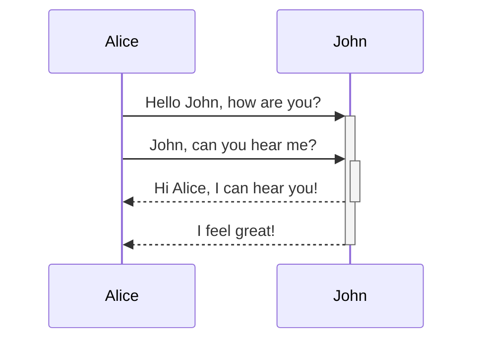

er kunnen ook sequantie-diagrammen gemaakt worden. door een code block als type "mermaid" te zetten kunnen hier diagrammen in gemaakt worden.

stappen:
1. maak een code block met "mermaid" als type
2. geef binnen het blok het type diagram aan: "sequenceDiagram"
3. ==Alice->>+John: Hello John, how are you?==

- "You can create [internal links](https://help.obsidian.md/Linking+notes+and+files/Internal+links) in your diagrams by attaching the `internal-link` [class](https://mermaid.js.org/syntax/flowchart.html#classes) to your nodes."
-  A[Alice] B[John] + A ->> B